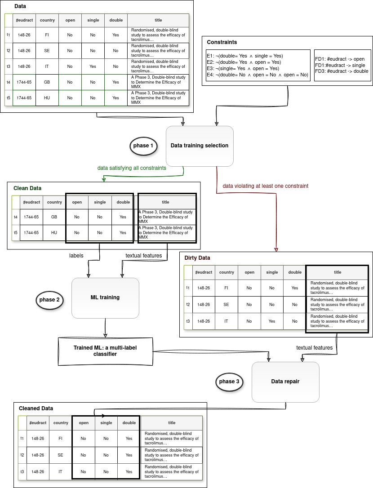

### Evaluating the impact of keeping/removing inconsistencies in the training data
In ``ML_train'', you can test for threed different dataset the cases of removing or keeping inconsistencies in the datasets.
There are also three different ML algorithms (Logistic regression, Multinomial Bayesian, and XGBoost), as well two different NLP method (TF-IDF and BOW)  to evaluate the repair performance.
N.B. The missing values in the training dataset are already removed.

### Evaluating the repair for a selected ML model
In ``ML_repair'', the ML model can be trained with a dataset in its initial state after removing missing and inconsistent samples, and then apply a repair approach to the samples in the test dataset.
